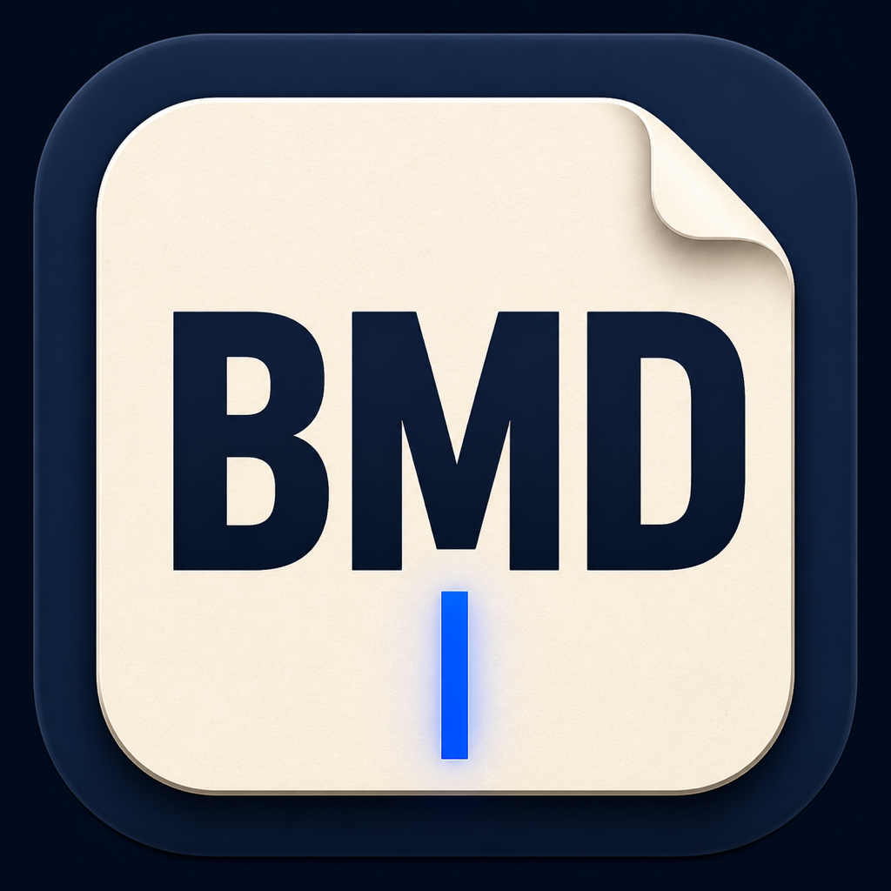
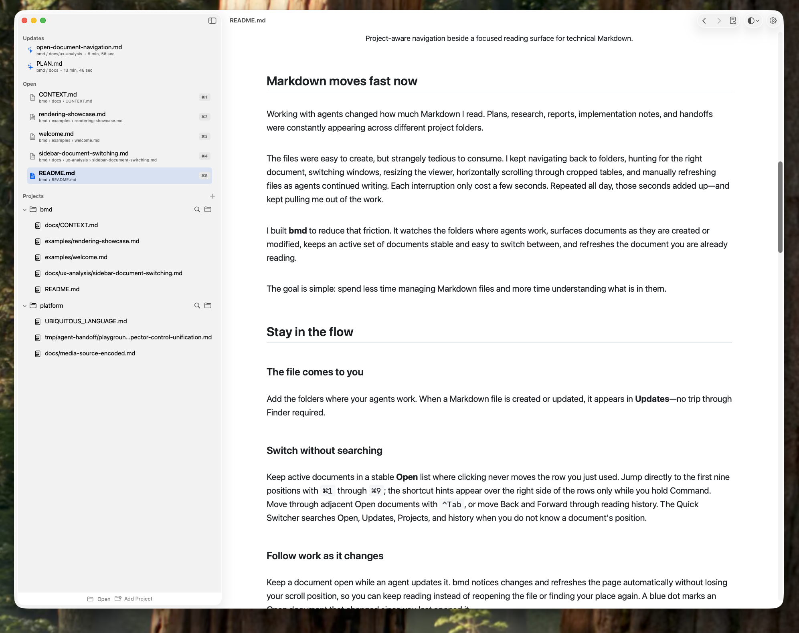
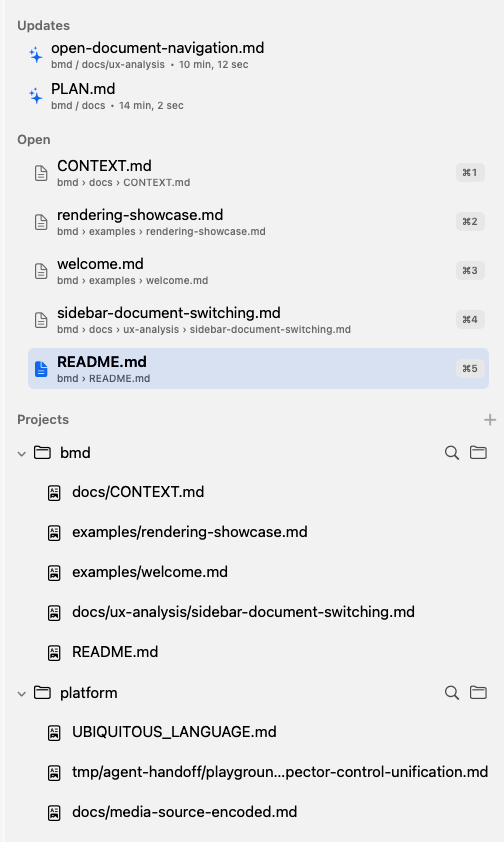
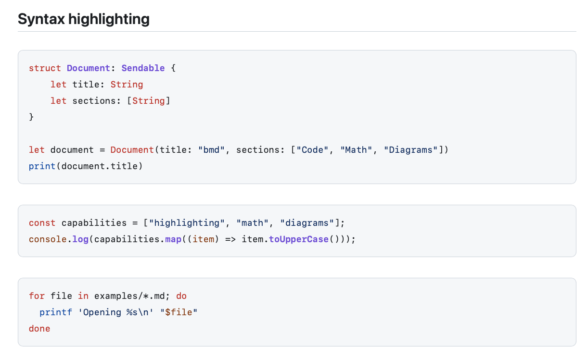
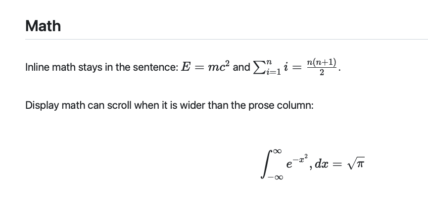
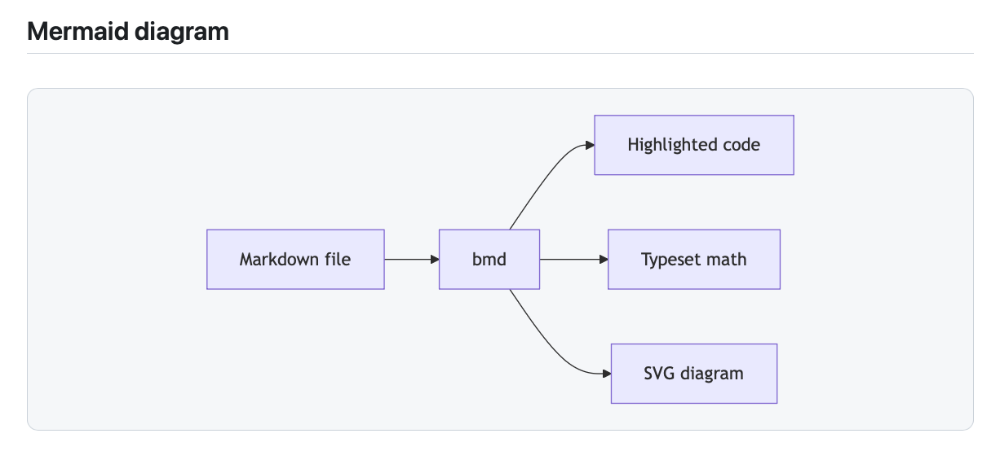
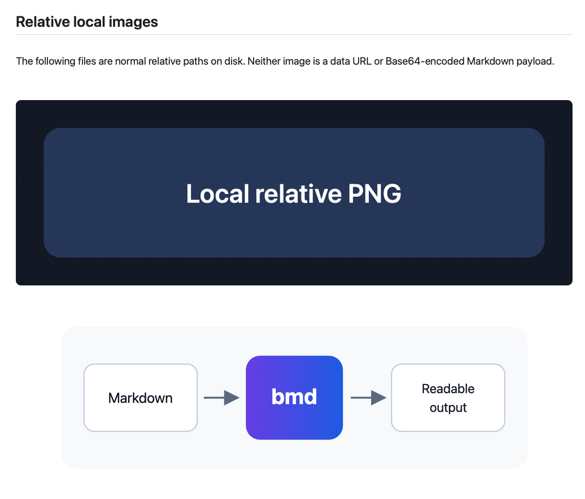

<p align="center">
  
</p>

<h1 align="center">bmd — Beautiful Markdown</h1>

<p align="center">
  <strong>A native Markdown reader for Mac, built for working with agents.</strong>
</p>

<p align="center">
  Find the document. Switch to it. Keep reading while it changes.
</p>

## Markdown moves fast now

Working with agents changed how much Markdown I read. Plans, research, reports,
implementation notes, and handoffs were constantly appearing across different
project folders.

The files were easy to create, but strangely tedious to consume. I kept
navigating back to folders, hunting for the right document, switching windows,
resizing the viewer, horizontally scrolling through cropped tables, and manually
refreshing files as agents continued writing. Each interruption only cost a few
seconds. Repeated all day, those seconds added up—and kept pulling me out of the
work.

I built **bmd** to reduce that friction. It watches the folders where agents
work, surfaces documents as they are created or modified, keeps an active set
of documents stable and easy to switch between, and refreshes the document you
are already reading.

The goal is simple: spend less time managing Markdown files and more time
understanding what is in them.

<p align="center">
  
</p>

<p align="center">
  <sub>The document stays in front while active work remains one click away.</sub>
</p>

## Stay in the flow

### The file comes to you

Add the folders where your agents work. When a Markdown file is created or
updated, it appears in **Updates**—no trip through Finder required.

### Switch without searching

Keep active documents in a stable **Open** list where clicking never moves the
row you just used. Jump directly to the first nine positions with `⌘1` through
`⌘9`; the shortcut hints appear over the right side of the rows only while you
hold Command. Move through adjacent Open documents with `⌃Tab`, or move Back and
Forward through reading history. When you vaguely remember a filename, press
`⌃P` to search every Markdown file in the current project or `⌃O` to search
across all added projects. Results favor filename and word-boundary matches, so
short fragments such as `rnd show` can find `rendering-showcase.md` without an
exact name or path.

### Follow work as it changes

Keep a document open while an agent updates it. bmd notices changes and refreshes
the page automatically without losing your scroll position, so you can keep
reading instead of reopening the file or finding your place again. A blue dot
marks an Open document that changed since you last opened it.

### Open it ready to read

New windows open centered, full-height, and wide enough for the sidebar and the
document. Reading width, table width, zoom, sidebar sizing, and the number of
Updates shown can be adjusted without dragging the same window into shape every
time.

<p align="center">
  
</p>

<p align="center">
  <sub>Updates surface agent changes. Open stays stable. Projects preserve location.</sub>
</p>

## Built for the Markdown agents actually produce

Agent output is rarely just a few paragraphs of prose. bmd renders the technical
documents that show up in real projects:

- syntax-highlighted code blocks
- wide GitHub Flavored Markdown tables
- Mermaid diagrams
- inline and display math
- SVG, PNG, JPEG, GIF, and WebP images referenced with local relative paths
- light and dark appearances that follow macOS automatically

Everything needed to render a document is bundled with the app. Reading works
offline, and local assets stay local.

<p align="center">
  
</p>

<p align="center">
  
</p>

<p align="center">
  
</p>

<p align="center">
  
</p>

## Try bmd

> **Current status:** bmd is in early development for macOS 14 Sonoma and newer.
> The daily reading workflow works, but packaged releases, signing,
> and notarization have not been finalized.

Clone the repository and install the current development build:

```bash
git clone https://github.com/brennancheung/bmd.git
cd bmd
./scripts/install
```

To make bmd the default application for common Markdown files:

```bash
./scripts/install --set-default
```

The application is installed at `/Applications/bmd.app`. Updates replace that
stable application, so macOS should not require you to choose the default
Markdown opener again after every build.

Once bmd is open:

1. Add the project folders where agents create Markdown.
2. Let the agent write files normally.
3. Open the latest document from **Updates**.
4. Keep reading while bmd follows subsequent changes.

## Open a document from an agent or script

The repository includes a command-line entry point:

```bash
./scripts/bmd path/to/report.md
```

You can optionally place it on your `PATH`:

```bash
ln -sf "$PWD/scripts/bmd" /usr/local/bin/bmd
bmd path/to/report.md
```

Opening a document adds it to **Open** without moving documents that are already
there. If the document belongs to an added project, bmd also keeps it under that
project for location-oriented navigation.

## How the sidebar works

- **Open** is a stable working set. Selecting a document changes its highlight,
  not its row position. New documents append to the bottom, and no document is
  removed automatically. Hold Command to reveal `⌘1` through `⌘9` as temporary
  trailing overlays. Documents can be pinned, moved explicitly, or closed.
- **Updates** shows new agent-created or agent-modified Markdown. A changed Open
  document receives a blue dot in place instead of appearing twice. Opening the
  document acknowledges that update; another on-disk change brings the dot back.
- **Projects** remembers the documents you opened inside each project without
  turning the sidebar into another enormous file tree. Project actions can open
  a Markdown-only file picker or reveal the project root in Finder.

Use `⌘1` through `⌘9` for direct positional access. Use `⌃Tab` and `⌃⇧Tab` to
move through adjacent Open documents. `⌘[` and `⌘]` move Back and Forward
through document history. Use `⌃P` to search the active document's project or
`⌃O` to search all added projects. Search results include Markdown that has not
previously been opened; use the arrow keys or `⌃J` and `⌃K` to navigate, then
Return to open. bmd remembers each document's reading position while you switch.

Project folders are watched recursively, but `node_modules`, hidden folders,
and application packages are skipped. Additional folder names can be ignored
from Settings. Right-click any file to copy its complete path or reveal it in
Finder.

## Built for macOS

bmd is a native SwiftUI application with a focused reading surface. It supports
the standard zoom shortcuts, system light and dark appearances, project-aware
file menus, and a menu-bar companion for opening Updates and active documents
without first finding the main window.

Closing the reader window leaves bmd available in the menu bar. Choose
**Quit bmd** when you want to stop the application completely.

<details>
<summary><strong>Architecture and local file access</strong></summary>

bmd uses SwiftUI for its window, navigation, settings, commands, and persistent
state. The navigation model is implemented as testable pure state transitions,
while `AppState` applies filesystem and persistence effects. A `WKWebView`
reading surface uses bundled copies of marked,
highlight.js, KaTeX, and Mermaid to render documents without a network
connection.

The direct-distribution build is intentionally not App Sandboxed because a
file-only Powerbox grant cannot read sibling images referenced by a Markdown
document. WebKit still receives no general `file:` access. Local resources are
served through a read-only URL handler after normalized-path containment checks
against the current document directory.

</details>

## Development

Requirements:

- macOS 14 Sonoma or newer
- Xcode 15 or newer

Open the Xcode project:

```bash
open bmd.xcodeproj
```

Run the native, state, watcher, asset-containment, and rendering checks:

```bash
./scripts/test
```

Useful project references:

- [`docs/CONTEXT.md`](docs/CONTEXT.md) explains the product intent and
  architecture.
- [`docs/PLAN.md`](docs/PLAN.md) tracks current milestones and the roadmap.
- [`docs/ux-analysis/sidebar-document-switching.md`](docs/ux-analysis/sidebar-document-switching.md)
  documents the interaction analysis behind Open, Updates, and Quick Switcher.
- [`docs/ux-analysis/open-document-navigation.md`](docs/ux-analysis/open-document-navigation.md)
  explains the stable positional shortcuts and the separation between Open order
  and document history.
- [`examples/rendering-showcase.md`](examples/rendering-showcase.md) exercises
  the supported rendering formats.

The rendering showcase can also be captured without opening an application
window:

```bash
BMD_APPEARANCE=light ./scripts/render-headless.swift \
  examples/rendering-showcase.md build/headless/showcase-light.png

BMD_APPEARANCE=dark ./scripts/render-headless.swift \
  examples/rendering-showcase.md build/headless/showcase-dark.png
```

## Roadmap

Near-term work includes interaction polish, testing with larger real-world
projects, release packaging, code signing and notarization, and deciding whether
a Quick Look extension belongs in the product.

## License

bmd is available under the [MIT License](LICENSE).
