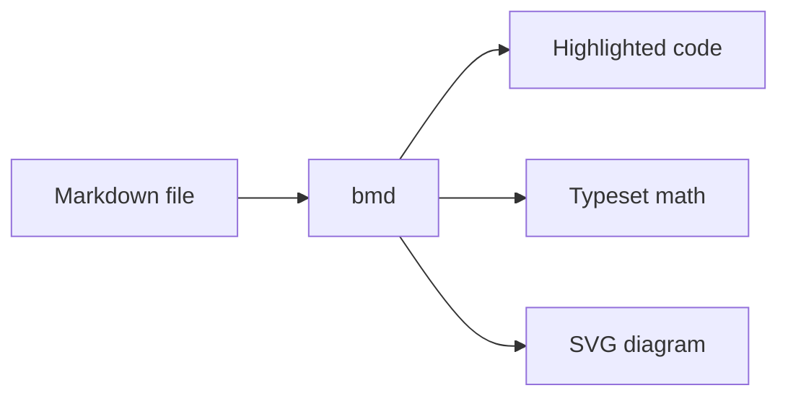
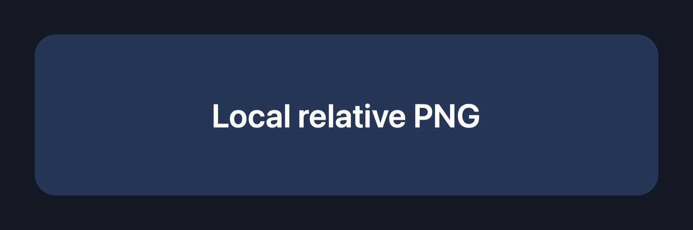
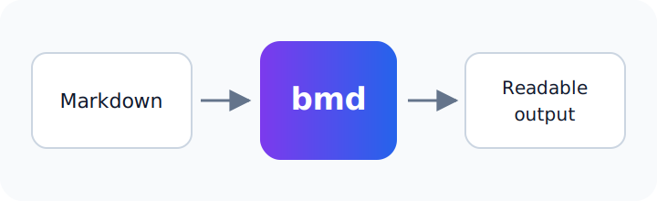

# Rendering showcase

This document exercises the complete offline rendering pipeline. Toggle the
macOS appearance between light and dark while it is open.

## Syntax highlighting

```swift
struct Document: Sendable {
    let title: String
    let sections: [String]
}

let document = Document(title: "bmd", sections: ["Code", "Math", "Diagrams"])
print(document.title)
```

```javascript
const capabilities = ["highlighting", "math", "diagrams"];
console.log(capabilities.map((item) => item.toUpperCase()));
```

```bash
for file in examples/*.md; do
  printf 'Opening %s\n' "$file"
done
```

```json
{
  "offline": true,
  "renderers": ["marked", "highlight.js", "KaTeX", "Mermaid"]
}
```

An unknown language remains readable instead of failing the document:

```made-up-language
render feature safely
```

## Math

Inline math stays in the sentence: $E = mc^2$ and
$\sum_{i=1}^{n} i = \frac{n(n+1)}{2}$.

Display math can scroll when it is wider than the prose column:

$$
\int_{-\infty}^{\infty} e^{-x^2}\,dx = \sqrt{\pi}
$$

## Mermaid diagram



An invalid diagram reports its own error without hiding the rest of the page:

```mermaid
flowchart LR
    Broken -->
```

## Relative local images

The following files are normal relative paths on disk. Neither image is a data
URL or Base64-encoded Markdown payload.





## Inline SVG

<svg viewBox="0 0 720 140" role="img" aria-labelledby="inline-title">
  <title id="inline-title">Inline SVG rendering fixture</title>
  <rect x="4" y="4" width="712" height="132" rx="20" fill="#0ea5e9" opacity="0.16" stroke="#0284c7" stroke-width="3" />
  <circle cx="92" cy="70" r="38" fill="#0284c7" />
  <path d="M 155 70 H 220 M 520 70 H 620" stroke="#0284c7" stroke-width="8" stroke-linecap="round" />
  <text x="360" y="82" text-anchor="middle" font-family="-apple-system, sans-serif" font-size="28" fill="currentColor">Inline SVG stays vector sharp</text>
</svg>

## Wide table

| Capability | Offline | Light/dark | Failure behavior |
|------------|---------|------------|------------------|
| Code | Yes | Themed tokens | Unknown languages stay readable |
| Math | Yes | Inherits text color | Invalid expressions show KaTeX errors |
| Mermaid | Yes | Theme selected per appearance | Error stays local to the diagram |
| Images | Yes | Original asset | Broken paths show native image failure |
